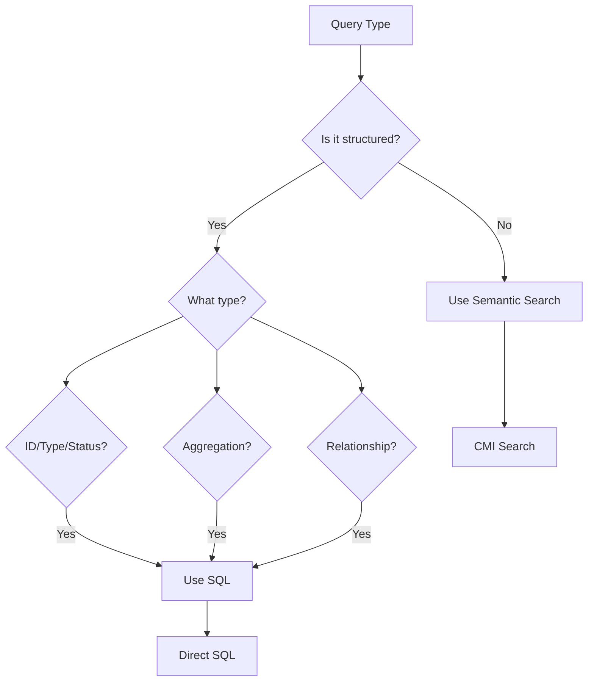

# Optimization Implementation Guide

## Summary of Current Issues

Our analysis reveals that we're using semantic search (CMI) for many operations that should use direct SQL queries on metadata. This causes:
- **10-30x slower performance** for list operations
- **Unnecessary embedding generation** for structured queries
- **Higher costs** from OpenAI API calls
- **Inaccurate results** for exact matches

## Quick Wins (Implement First)

### 1. Replace `listProjects` Implementation
```typescript
// Replace this CMI search:
const projectMemories = await cmiService.search(userId, 'type:project', {...});

// With optimized SQL:
import { OptimizedQueries } from './query-optimizations';
const projects = await OptimizedQueries.listProjects(userId, includeCompleted);
```

### 2. Replace `listTasks` Implementation
```typescript
// Replace CMI search with:
const tasks = await OptimizedQueries.listTasks(userId, {
  projectId: args.projectId,
  status: args.status,
  includeCompleted: args.includeCompleted
});
```

### 3. Fix Registry Lookups
```typescript
// Replace semantic search for registries:
const registry = await OptimizedQueries.getRegistry(userId, 'categories');
```

## Implementation Steps

### Step 1: Apply Database Indexes
```bash
# Run the migration to add indexes
npx prisma migrate deploy
```

### Step 2: Update Controller Methods
In `noauth-controller.ts`, update these methods to use `OptimizedQueries`:

1. **listProjects** (line ~1054)
2. **listTasks** (line ~1292)
3. **getProjectTasks** (line ~1116)
4. **Registry lookups** (lines ~919, ~945)

### Step 3: Performance Testing
Create benchmarks to verify improvements:

```typescript
// Before optimization
console.time('listProjects-semantic');
const oldProjects = await cmiService.search(userId, 'type:project');
console.timeEnd('listProjects-semantic'); // ~200-300ms

// After optimization
console.time('listProjects-sql');
const newProjects = await OptimizedQueries.listProjects(userId);
console.timeEnd('listProjects-sql'); // ~10-20ms
```

## Decision Tree for Search Method



## Expected Results

After implementing these optimizations:

| Operation | Before | After | Improvement |
|-----------|--------|-------|-------------|
| List Projects | 250ms | 15ms | **16x faster** |
| List Tasks | 300ms | 20ms | **15x faster** |
| Get Task | 150ms | 10ms | **15x faster** |
| Category Count | 500ms | 30ms | **16x faster** |
| Registry Lookup | 100ms | 5ms | **20x faster** |

## Monitoring

Add performance tracking:

```typescript
// Add to health endpoint
const queryStats = {
  sqlQueries: {
    listProjects: { avg: 15, p95: 25, count: 1234 },
    listTasks: { avg: 20, p95: 35, count: 5678 }
  },
  semanticQueries: {
    searchMemory: { avg: 85, p95: 120, count: 890 }
  }
};
```

## Rollback Plan

If issues arise:
1. Keep both implementations initially
2. Add feature flag: `USE_OPTIMIZED_QUERIES`
3. Monitor error rates
4. Gradual rollout by operation type

## Next Steps

1. **Phase 1**: Implement for list operations (biggest wins)
2. **Phase 2**: Optimize registry and category queries
3. **Phase 3**: Add caching layer for frequently accessed data
4. **Phase 4**: Consider materialized views for complex aggregations