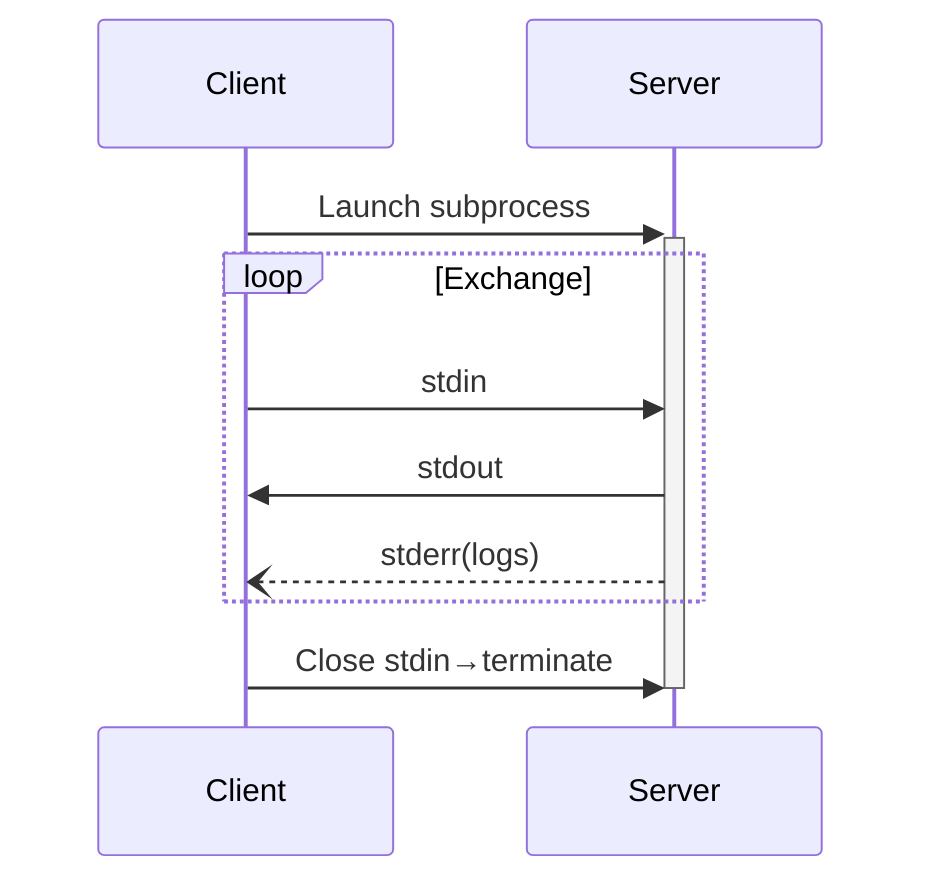
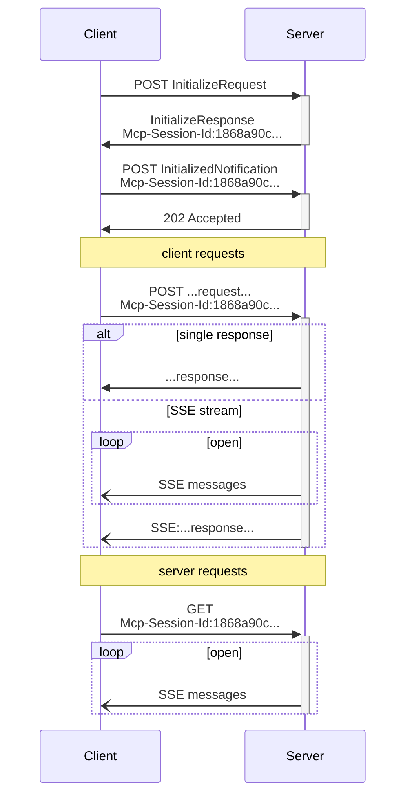

compression: 71%→76% | mode: T→M | segments: 8

# MCP Transports

T:@protocol:2025-03-26
@encoding:JSON-RPC+UTF-8
@transports:[stdio,StreamableHTTP]
@requirement:clients_SHOULD_support_stdio

## stdio

@flow:client→subprocess(server)
@channels:{
  stdin:client→server[requests,notifications,responses,batch]
  stdout:server→client[same_types]
  stderr:server→logs(UTF-8,optional)
}
@rules:{
  delimiter:newline
  !embedded_newlines
  !stdout:only_valid_MCP
  !stdin:only_valid_MCP
}



## Streamable HTTP

N:Replaces HTTP+SSE from 2024-11-05T:
@server:independent_process{multi_client}
@endpoint:single_path{POST,GET,DELETE?}
@supports:[basic,streaming,SSE,notifications]

### Security⚠️
```
!validate:Origin_header→prevent_DNS_rebinding
!bind:localhost(127.0.0.1)≠0.0.0.0
!implement:auth_all_connections
```

### Client→Server Messages

@method:POST→MCP_endpoint
@headers:{Accept:["application/json","text/event-stream"]}
@body:single[request|notification|response]|batch[requests+notifications|responses]

@response_rules:{
  if(only[responses|notifications])→{
    success:202_Accepted∅body
    error:4xx+JSON-RPC_error(id:null)?
  }
  if(contains[requests])→{
    Content-Type:"text/event-stream"|"application/json"
    !client_MUST_support_both
  }
}

#### SSE Stream Rules
M:When server returns SSE:
- T:SHOULD:1_response/request(may_batch)
- MAY:send[requests,notifications]_before_responses
- SHOULD_NOT:close_before_all_responses(unless_session_expires)
- SHOULD:close_after_all_responses
- @disconnection:{
  MAY:anytime
  !interpret≠cancel
  cancel:explicit_CancelledNotification
  mitigate:resumable_stream
}

### Server→Client Messages

@method:GET→MCP_endpoint
@headers:{Accept:"text/event-stream"}
@response:SSE_stream|405_Method_Not_Allowed

#### SSE Rules
- MAY:send[requests,notifications](may_batch)
- SHOULD:unrelated_to_concurrent_client_requests
- MUST_NOT:send_response(unless_resuming)
- MAY:close_anytime
- client_MAY:close_anytime

### Multi-Connection
- client_MAY:multiple_SSE_streams
- server_MUST:send_each_msg→1_stream(!broadcast)
- risk_mitigation:resumable_streams

### Resumability

@mechanism:SSE_event_id
@rules:{
  id:globally_unique/session|client
  resume:GET+Last-Event-ID_header
  server_MAY:replay_after_id(same_stream_only)
  !replay:different_stream_messages
}
@concept:per-stream_cursor

### Session Management

@session:logical_interactions{init→end}
@implementation:{
  1.init:server_MAY→Mcp-Session-Id_header(InitializeResult)
    - SHOULD:unique+secure(UUID|JWT|hash)
    - MUST:visible_ASCII[0x21-0x7E]
  2.client_MUST:include_header→all_subsequent_requests
  3.no_session?→400_Bad_Request
  4.terminate:server_MAY→404_Not_Found
  5.404?→client_MUST:new_InitializeRequest(no_id)
  6.cleanup:client_SHOULD→DELETE+session_id
    - server_MAY:405(no_client_termination)
}

### Sequence


### Backwards Compatibility

#### Servers→N(support old clients)
- Host:old[SSE,POST]+new[MCP_endpoint]
- Option:combine_endpoints(complexity++)

#### Clients→N(support old servers)
@flow:{
  1.accept:URL(old|new_transport)
  2.try:POST_InitializeRequest+Accept_header
    - success→new_StreamableHTTP
    - 4xx→{
      GET→expect_SSE+endpoint_event
      endpoint_arrives→old_HTTP+SSE
    }
}

## Custom Transports

M:Implementers MAY create custom transportsT:
@requirements:{
  MUST:preserve[JSON-RPC_format,lifecycle]
  SHOULD:document[connection,exchange_patterns]
}
@concept:transport-agnostic→any_bidirectional_channel

legend:
@: definition/reference
→: sequence/maps-to
!: required/forbidden
∅: empty/null
≠: not-equal
⚠️: warning
[]: array/options
{}: object/group
|: or
+: and/plus
?: optional
MAY/MUST/SHOULD: RFC2119

